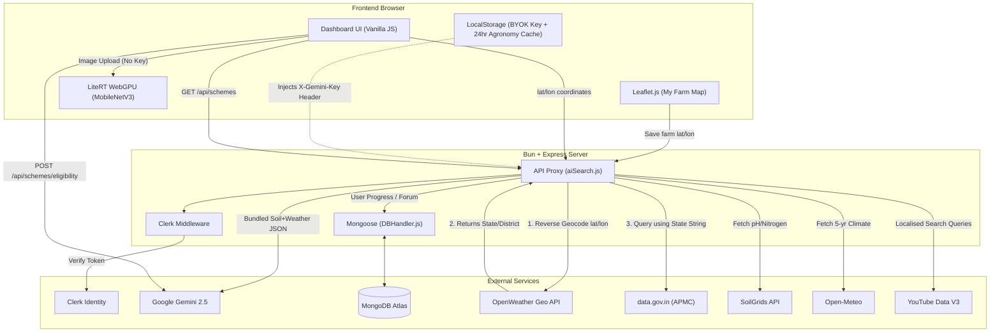

# 🌾 PRAGATI PATH — AI-Powered Agricultural Education Platform

PRAGATI PATH is a full-stack web platform designed to assist Indian farmers by leveraging **AI technology**, **multilingual support**, and **image recognition**. It provides crop suggestions, disease diagnosis, and educational content to improve agricultural outcomes.

## 💡 Key Features

- 🤖 **AI Chatbot** using **Google Gemini 2.5 Flash** for farming-related query resolution in local languages
- 🌱 **Crop Recommendation System** based on user location and weather data
- 🗺️ **"My Farm" Interactive Map** — Leaflet.js pin-drop map where farmers mark their exact plot. GPS coordinates are saved to MongoDB and automatically passed to the entire agronomy pipeline (SoilGrids, Open-Meteo, Mandi prices) — no manual input needed.
- 🦠 **Plant Disease Detection** (Dual Mode)
  - **Primary:** Gemini Vision (Analyzes any crop, provides treatment/prevention)
  - **Fallback:** Offline MobileNetV3-Large (128 unified classes) running natively in-browser via **LiteRT WebGPU** (Fast, private, works offline)
- 🌍 **Deep Agronomy Engine** — Integrates SoilGrids (soil chemistry) and Open-Meteo (5-year historical climate) for hyper-local precision agriculture. Results cached in localStorage for 24 hours to eliminate redundant API calls.
- 📊 **Market Integration** — Real-time APMC Mandi commodity prices via `data.gov.in`.
  - **Zero-Cost Synergy:** Utilizes OpenWeather's Reverse Geocoding API to dynamically translate raw GPS coordinates into the strict text-based state/district format required by the Indian Government API, seamlessly bridging two incompatible systems.
- 💬 **Krishi Charcha Forum** — A community discussion board for farmers to share tips, crop alerts, and ask questions.
- 🏛️ **Government Schemes Tracker** — Static database of 7 national schemes (PM-KISAN, PMFBY, KCC, PMKSY, eNAM, Soil Health Card, PM-KUSUM) with eligibility info, helplines, and direct apply links
  - ⚠️ **Deadline Banners** — Auto-shows PMFBY Kharif/Rabi or PM-KISAN installment alerts based on current month (pure date math, zero API)
  - 🤖 **AI Eligibility Check** — Gemini ranks all 7 schemes by priority for the farmer's state, crops, and land ownership
- 🗓️ **Smart Farming Calendar** — Daily learning tracker with a **Crop Timeline Overlay**: pinned crops show their sowing/growing/harvest phase for each calendar month (zero API calls)
- 🌡️ **Weather-Aware Greeting** — Contextual farming tip (e.g. "🌧️ Rain today — delay pesticides") shown after weather loads, using already-fetched data; **zero extra API requests**
- 📤 **WhatsApp Share** — One-tap share of plant disease scan results (works on both Gemini and offline AI modes)
- 🌐 **Language-Aware YouTube Search** — Reads the active Google Translate language and appends it to every YouTube query (supports 9 Indian languages: Hindi, Bengali, Tamil, Telugu, Marathi, Gujarati, Kannada, Malayalam, Punjabi)
- 📺 **YouTube Learning Module** — Fetches top relevant videos and tracks course completion progress
- 🎓 **Certificate Generator** — Completing a course (≥95% watched) unlocks a downloadable PDF certificate of completion via `html2pdf.js`
- 🔐 Secure login and protected routes using **Clerk** authentication
- 🔑 **BYOK Architecture (Bring Your Own Key)** — Gemini API keys are securely provided by users and stored only in their local browser storage, ensuring free hosting and no central API cost.

## 🌐 Live Preview

🔗 [https://pragatipath.onrender.com/](https://pragatipath.onrender.com/)

## 🛠 Tech Stack

- **Frontend:** HTML, Vanilla CSS, JavaScript, Leaflet.js (interactive map)
- **Backend:** Bun, Express.js
- **Database:** MongoDB (via Mongoose)
- **AI Integration:** Google Gemini (Generative AI), LiteRT.js (WebGPU WASM)
- **Auth:** Clerk
- **PDF Export:** html2pdf.js (Certificate Generator)

## 🏗 Architecture



## 📦 Getting Started

### Prerequisites
- [Bun](https://bun.sh/) (Runtime and package manager)

### Installation

```bash
git clone https://github.com/vikashgupta16/PragatiPath.git
cd PragatiPath
bun install
```

### Environment Variables

Create a `.env` file in the root directory:
```env
CLERK_SECRET_KEY=your_secret_key
CLERK_PUBLISHABLE_KEY=your_publishable_key
CLERK_SIGN_IN_URL=/public/Accounts/signin.html
CLERK_SIGN_UP_URL=/public/Accounts/signup.html
MONGO_URI=your_mongodb_connection_string
YOUTUBE_API_KEY=your_youtube_api_key
OPENWEATHER_API_KEY=your_openweather_api_key
GOV_DATA_API_KEY=your_gov_api_key
```

### Run the App

```bash
bun run dev
```

The app will be running at `http://localhost:8080`.

## 📖 Documentation
- [How the Offline Plant AI Works](docs/plant-ai-how-it-works.md)

## 📂 Project Structure

```
/client               # Frontend (Public Landing, Private Dashboard)
/server               # Express API routes, Auth middleware, Database schemas
/docs                 # Technical documentation
/scripts              # AI Model kaggle scripts, dataset dictionary generators
```

## 👨‍💻 Authors

- [**Rouvik Maji**](https://github.com/Rouvik) – *Backend Developer*
- [**Archis**](https://github.com/Dealer-09) – *Backend/Frontend Developer*
- [**Vikash Gupta**](https://github.com/vikashgupta16) – *Frontend Developer*
- [**Rajbeer Saha**](https://github.com/pixelpioneer404) – *Frontend Developer*

## 📄 License

GPL-3.0 © 2025 Archisman Pal