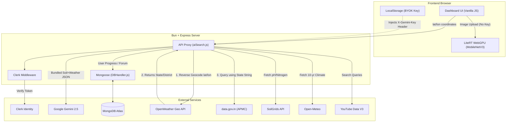

# 🌾 PRAGATI PATH — AI-Powered Agricultural Education Platform

PRAGATI PATH is a full-stack web platform designed to assist Indian farmers by leveraging **AI technology**, **multilingual support**, and **image recognition**. It provides crop suggestions, disease diagnosis, and educational content to improve agricultural outcomes.

## 💡 Key Features

- 🤖 **AI Chatbot** using **Google Gemini 2.5 Flash** for farming-related query resolution in local languages
- 🌱 **Crop Recommendation System** based on user location and weather data
- 🦠 **Plant Disease Detection** (Dual Mode)
  - **Primary:** Gemini Vision (Analyzes any crop, provides treatment/prevention)
  - **Fallback:** Offline MobileNetV3-Large (128 unified classes) running natively in-browser via **LiteRT WebGPU** (Fast, private, works offline)
- 🌍 **Deep Agronomy Engine** — Integrates SoilGrids (soil chemistry) and Open-Meteo (historical climate) for hyper-local precision agriculture.
- 📊 **Market Integration** — Real-time APMC Mandi commodity prices via `data.gov.in`.
  - **Zero-Cost Synergy:** Utilizes OpenWeather's Reverse Geocoding API to dynamically translate raw GPS coordinates into the strict text-based state/district format required by the Indian Government API, seamlessly bridging two incompatible systems.
- 💬 **Krishi Charcha Forum** — A community discussion board for farmers to share tips, crop alerts, and ask questions.
- 📺 **YouTube Learning Module** — fetches top relevant videos and allows tracking course progress
- 🔐 Secure login and protected routes using **Clerk** authentication
- 🔑 **BYOK Architecture (Bring Your Own Key)** — Gemini API keys are securely provided by users and stored only in their local browser storage, ensuring free hosting and no central API cost.

## 🌐 Live Preview

🔗 [https://pragatipath.onrender.com/](https://pragatipath.onrender.com/)

## 🛠 Tech Stack

- **Frontend:** HTML, Vanilla CSS, JavaScript
- **Backend:** Bun, Express.js
- **Database:** MongoDB (via Mongoose)
- **AI Integration:** Google Gemini (Generative AI), LiteRT.js (WebGPU WASM)
- **Auth:** Clerk

## 🏗 Architecture



## 📦 Getting Started

### Prerequisites
- [Bun](https://bun.sh/) (Runtime and package manager)

### Installation

```bash
git clone https://github.com/vikashgupta16/PragatiPath.git
cd PragatiPath
bun install
```

### Environment Variables

Create a `.env` file in the root directory:
```env
CLERK_SECRET_KEY=your_secret_key
CLERK_PUBLISHABLE_KEY=your_publishable_key
CLERK_SIGN_IN_URL=/public/Accounts/signin.html
CLERK_SIGN_UP_URL=/public/Accounts/signup.html
MONGO_URI=your_mongodb_connection_string
YOUTUBE_API_KEY=your_youtube_api_key
OPENWEATHER_API_KEY=your_openweather_api_key
GOV_DATA_API_KEY=your_gov_api_key
```

### Run the App

```bash
bun run dev
```

The app will be running at `http://localhost:8080`.

## 📖 Documentation
- [How the Offline Plant AI Works](docs/plant-ai-how-it-works.md)

## 📂 Project Structure

```
/client               # Frontend (Public Landing, Private Dashboard)
/server               # Express API routes, Auth middleware, Database schemas
/docs                 # Technical documentation
/scripts              # AI Model kaggle scripts, dataset dictionary generators
```

## 👨‍💻 Authors

- [**Rouvik Maji**](https://github.com/Rouvik) – *Backend Developer*
- [**Archis**](https://github.com/Dealer-09) – *Backend/Frontend Developer*
- [**Vikash Gupta**](https://github.com/vikashgupta16) – *Frontend Developer*
- [**Rajbeer Saha**](https://github.com/pixelpioneer404) – *Frontend Developer*

## 📄 License

MIT © 2025 Archisman Pal